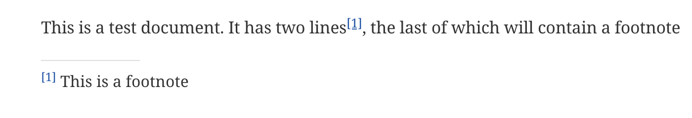
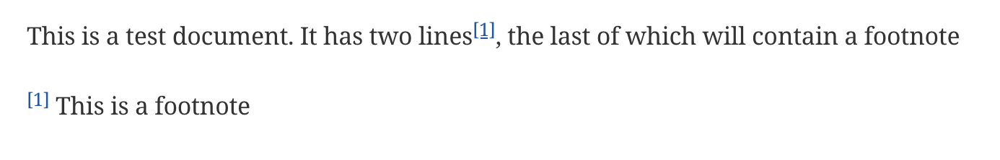

# Asciidoctor Anywhere Footnote

## Introduction

We've all been there: you're out in the pouring rain with a flat battery.
What's worse, when you pop the boot, you realize that you've left the spare charging in the garage.
And to top it all, you still have that AsciiDoc table that's going to need a lot of footnotes.

That's going to be a real bind if you want them to show up near the table, instead of right at the end of the page.

Well, there's little you can do about the rain and the flat battery, but there may be something you can do about the footnotes. …

## Anywhere Footnote

This is an inline macro that you can use in most places that you'd be able to use `footnote`.
The main difference is that it includes a parameter that it uses to reference the location of the footnote block:

```asciidoc
This is a piece of text{empty}afnote:footnote-block[This is the text of the footnote.]
```


The macro parameter (`footnote-block`) points to the `afnote` block where the footnote will be rendered:

```asciidoc
This is where the footnote block goes:

afnote::footnote-block[]
```
> **Note**: Block macros must appear on their own line with no other characters.


> **Tip** You can also use a single colon for the footnote block macro. (`afnote:footnote-block[]`)

All the footnotes with the same identifier will be rendered in the same block,
so you can have multiple footnote blocks on your page.

The inline tag (single colon) supports extra parameters, as well as the text for the footnote.

```
afnote:my-block[Footnote text] // (1)
afnote:my-block[reftext="Footnote text", refid="footnote-id"] // (2)
afnote:my-block[refid="footnote-id"] (3)
afnote:my-block[reftext="Footnote text", marker="*"] (4)
afnote:my-block[reftext="Footnote text", lbrace="(" rbrace=")"] (5)
```


1. The standard pattern. The text in brackets will be used as the footnote.
2. You can also set the footnote text using the `reftext` parameter. In this case we’re also using the `refid` to set a reusable reference identifier.
3. The `refid` is used to reference an existing footnote so that multiple footnote references can point to the same footnote.
4. Normally, the footnotes are numbered per block, but if you wish, you can assign your own marker for any footnote.
5. As a default, the footnote markers are encased in square brackets. You can change this (to parentheses, for example)
   by using the `lbrace` and/or `rbrace` parameters.

> **Tip** If you don't want any kind of bracket encasing the footnote,
> then set both `lbrace` and `rbrace` to `{empty} or empty strings.`
>
> You don't have to use both parameters. If you set `lbrace={empyty}` and  `rbrace=")"`, for example, you can footnote marked like this: `1)`

## The Stylesheet

The footnotes and the footnote block are rendered in HTML with an attached style (`anywhere-footnote`).
It's included here for reference:

```css
.afnote-marker {
   vertical-align: super;
   font-size: 100%;
   text-decoration: none;
}

.afnote-marker::before {
   content: "[";
}

.afnote-marker::after {
   content: "]";
}

.afnote-block {
   text-decoration: none;
}

.afnote-hr-divider {
   height: 1px;
   background-color: #ccc; /* Standard gray color similar to default HR */
   border: none;
   margin: 0.5em 0; /* Standard HR margin */
   width: 20%;
}

div.afnote-horizontal dl {
   display: grid;
   grid-template-columns: 30px auto;
   grid-column-gap: 1px;
}

/* Force each dt and dd to be on the same line */
div.afnote-horizontal dl > dt,
div.afnote-horizontal dl > dd {
   display: inline !important;
   vertical-align: top !important;
   margin: 0 !important;
   padding: 0 !important;
}

/* Remove margins from paragraphs inside dd */
div.afnote-horizontal dl > dd p {
   display: inline;
   margin: 0;
   padding: 0;
}

```

## Omitting the separator

Normally, the footnote block is rendered with a short horizontal line above the footnotes:



To omit the separator, add the `omit-separator` attribute to the block tag.

```asciidoc
afnote:footnote-block[omit-separator="true"]
```


## Alternative counting formats

By default, the footnotes will be counted using the standard Arabic notion (1, 2, 3, …).
But other forms can be used by adding an attribute selector to your page:

```asciidoc
:afnote-format: alpha
```
The footnotes will use a single letter as a footnote marker.


> ** Warning** Do not use this format if you have more than 26 footnotes on your page.

You can also use roman numerals.

```asciidoc
:afnote-format: roman
```

> ** Warning** Do not use this format if you have more than 3999 footnotes on your page.
> (Though if you did then I suspect footnote formatting would be the least of your problems)

Omit the `afnote-format` attribute for standard arabic, or use:

```asciidoc
:afnote-format: arabic
```

> ** Note ** Bear in mind that the roman format will take up more space 
## Controlling the Count

Normally, the footnotes are numbered page-wide: starting at 1 then continuing to the end of the page.
If you prefer the count reset to be reset to 1 each time a new block is encountered,
then put this near the top of the page (before the first footnote):

```asciidoc
:afnote-block-reset: true
```

## Suppressing the separators globally

There is also the option of suppressing the separators for the entire page  
by declaring the following variable near the top of the page (before the first footnote):

```asciidoc
:afnote-omit-separators: true
```

## Running the Extension

Add the extension to your Node installation:

```shell
npm i asciidoctor-anywhere-footnote
```
Then extension can be used with an AsciiDoctor ``convert()`` call:

```javascript

registry = asciidoctor.Extensions.create();
require('../anywhere-footnote-processor')(registry);

let converted_doc = asciidoctor.convert(input_document,{safe: 'safe', standalone: true,
   extension_registry: registry})
```

Or as part of your Antora installation:
 
```yaml
  extensions:
  - asciidoctor-kroki
  - asciidoctor-external-callout
  - '@asciidoctor/tabs'
  - asciidoctor-anywhere-footnote
```


